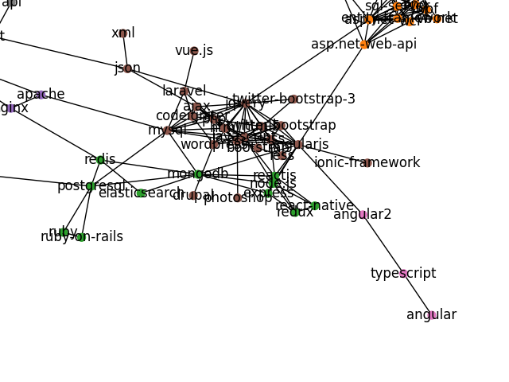
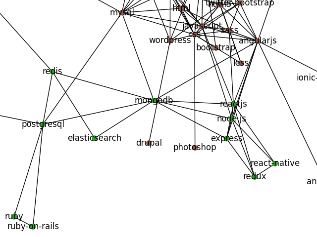
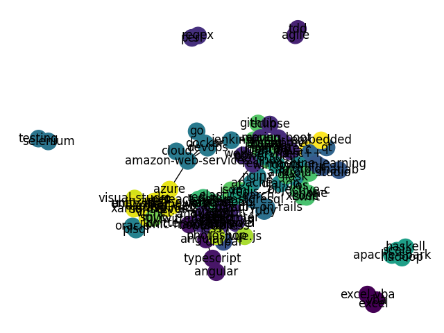
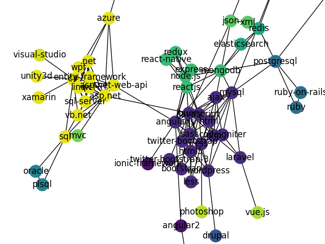
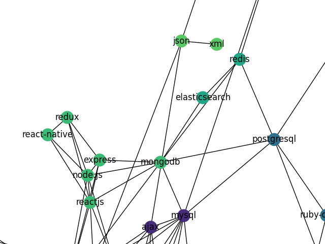
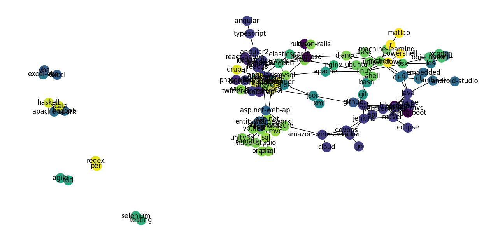
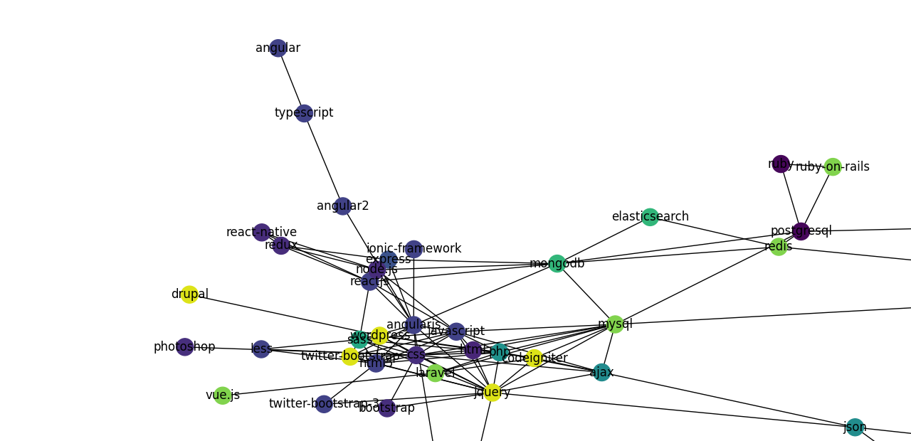
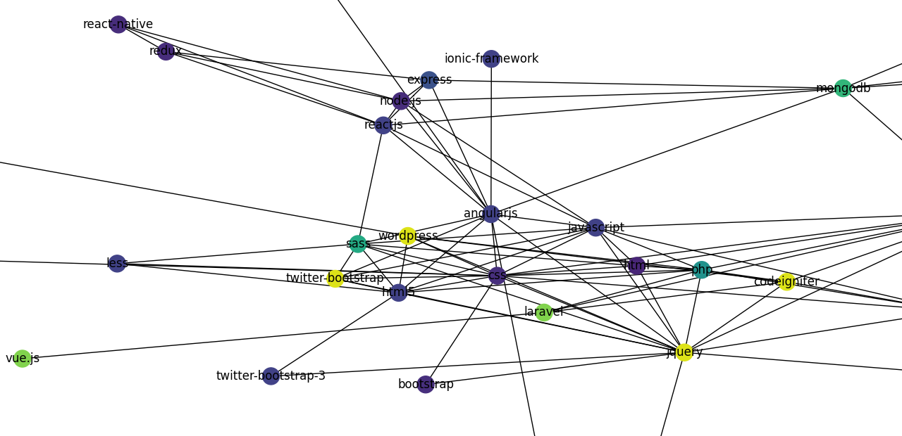

# Eliminating Disconnected Communities: A Comparative Study on Louvain and Leiden

## Abstract

For this project, we will be replicating the paper "From Louvain to Leiden: guaranteeing well-connected communities". The paper introduces the Leiden algorithm, a community detection method developed to improve upon the Louvain algorithm, a widely-used approach for identifying communities in networks. The Louvain algorithm has been criticized for producing poorly connected or even disconnected communities, which can be problematic for clustering and interpreting the communities of complex networks. To overcome this issue, the authors propose the Leiden algorithm, which guarantees the connectivity of communities by ensuring that all subsets of all communities are locally optimally assigned. The paper provides a detailed description of both the Louvain and the Leiden algorithms, and a comparative analysis between them, demonstrating its superior performance of the Leiden algorithm in terms of being more computationally efficient and creating more well-communities. To build upon the research presented in the paper, we initially apply the model to network data from stack overflow found on Kaggle, a large-scale real-world network that was not explored in the original study. Then for the extention of the paper, we explored the possibility of using degree partitioning instead of singleton partitioning in the initial stage for both the Louvain algorithm and Leiden, and see if this would further improve their efficiency.

## Introduction

The Louvain method has been a popular community detection algorithm used to identify clusters or communities within large networks or graphs in various fields, including social network analysis, biology and so on. The biggest problem in Louvain is that a node can be moved to a different community even if it was acting as the bridge for different parts of its old community. Removing this node might split the old community into separate parts, which doesn't necessarily mean the other nodes from the old community will also be moved to new communities. Since the remaining nodes might still have strong connections within their community, even though the nodes now are being disconnected from one another, Louvain has no mechanism for fixing these broken communities. Leiden, on the other hand, is achieved through a refined optimization process that includes fast local moves and random neighbor moves, allowing it to split communities that are already defined during the initial partitioning phaseinto multiple sub communities during the refining phase. By creating the aggregate network based on refined partitioning rather than the original partitioning, the Leiden algorithm has more room for identifying high-quality partitions compared to the Louvain algorithm.

## Experiment

The process of the Louvain model begins with an initial partition where each node in the network is assigned to its own distinct community. This is also known as the "singleton partitioning". It then iteratively reassigns nodes to different communities in a way that seeks to optimize the overall modularity of the partition through quality function. After each round of node reassignment, the algorithm constructs a new, aggregated network where each community from the previous step is represented as a single, larger node. This process of node reassignment and network aggregation is repeated, further refining the community structure at each level of aggregation until no further improvement in modularity is possible. As mentioned previously, the problem with the process is that it has no mechanism in ensuring that there will be no broken subcommunities if such communities are created during the refining phase. This scenario is depicted in Figure 1.

**Figure 1**: When node 0 is moved to a different community, the red community becomes internally disconnected, as shown in (b). However, nodes 1–6 are still locally optimally assigned, yielding the community these nodes in broken.

The Leiden algorithm, like the Louvain algorithm, begins with a singleton partition. It then iteratively moves individual nodes between communities to find an optimal partition, which is then refined. After refinement, an aggregate network is created using the initial, non-refined partition to form the basis for the aggregate network's partition. However, the main distinction between Leiden and Louvain is that Leiden takes an extra step to fine-tune the community structure to optimize it further. In contrast to Louvain, the Leiden algorithm creates subgroups from the original groups, not the refined ones, and this refinement step does not alter the partition. These steps are repeated until no further improvements can be made, resulting in a more fine-tuned community detection with none to little broken communities compared to the Louvain algorithm.

It is important to note that in the refinement phase of the algorithm, nodes are not always combined with the community that gives the biggest improvement in the quality function like how Louvain functions. Instead, a node can be combined with any community that makes the quality function go up. This randomness in choosing a community helps explore more options for grouping nodes. The algorithm does not consider combining nodes if it would make the quality function worse, making the model structure more efficient than the Louvain algorithm.

## Results for "Zachary's Karate Club" Data

We first implemented Louvain on the small network data “Zachary’s Karate Club”. Zachary's Karate Club is a built-in dataset of the python library NetworkX, and it is a well-known social network dataset that represents the friendships between 34 members of a karate club at a US university in the 1970s that is often used for testing and as a benchmark in social network analysis, community detection, and graph clustering research, including the academic paper we are replicating in this project. It is important to note that the karate club eventually split into two separate clubs due to a conflict between the instructor (node 0) and the club president (node 33), and by only looking at the network before community detection, it is pretty obvious that there are two loosely formed clusters around note 0 and node 33.

**Figure 2**: A raw visualization of the Zachary Club network

As shown in the Figure 3, the Louvain model separated the graph into four communities, as represented by different colors. By looking at the graph, it is clear that node 9 is poorly connected to the rest of its community, and the community consisting of nodes 24, 25, 28, and 31 is somewhat interfered with by nodes from nearby communities. Despite these minor flaws, it overall does a pretty good job of segregating nodes into communities. This is expected because Louvain's major flaw of creating poorly connected or disconnected communities usually only occurs in larger network data.

**Figure 3**: the Zachary Club network after being separated by Louvain. The communities are color coded.

Theoretically speaking, the Leiden model is supposed to perform better than the Louvain model. However, as our results in Figure 4 show, the Leiden model was not as successful in identifying the rift between node 0 and node 33.

**Figure 4**: the Zachary Club network after being separated by Leiden. The communities are color coded.

It did, however, successfully divide the nodes into groups and avoid disconnectedness between nodes in the same group.

To further investigate the realistic performance of both Louvain and Leiden, we implemented them on a large network data: Stack Overflow Tag Network.

## Results for "Stack Overflow Tag Network" Data

The Kaggle dataset "Stack Overflow Tag Network" represents a network of technology tags from Developer Stories on the Stack Overflow online developer community website, and is organized as two tables:

1. **stack_network_links** contains links of the network, the source and target tech tags plus the value of the the link between each pair
2. **stack_network_nodes** contains nodes of the network, the name of each node, which group that node belongs to (calculated via a cluster walktrap), and a node size based on how often that technology tag is used.

Figure 5 displays images of how the Stack Overflow graph should look like, according to their own clustering of the network tags.

**Figure 5**: Images of the Stack Overflow Network. The color coding of the network provides litmus test for how well Louvain and Leiden perform at communizing larger networks.

In comparison, Figure 6 shows how the Louvain algorithm performs with the same data.

**Figure 6**: Images of the Stack Overflow Network with the Louvain algorithm run on it.

Clearly the Louvain algorithm has successfully identified several communities in the network, and has fit the data quite well. Zooming in displays that like the Stack Overflow tags themselves, the Louvain algorithm grouped JavaScript frameworks like Node and React close together and often in relation to MongoDB. The [MERN Stack](https://www.mongodb.com/mern-stack#:~:text=MERN%20stands%20for%20MongoDB%2C%20Express,the%20premier%20JavaScript%20web%20server) is a fairly common app development approach, so we can use this to appraise Louvain's performance as pretty good.

**Figure 7**: Images of the Stack Overflow Network with the Leiden algorithm run on it.

The Leiden algorithm has also successfully identified several communities in the network, but there are noticeable differences in the grouping. The most notable difference is in the seemingly isolated nodes. For instance, in the Louvain algorithm, Vue.js is an isolated node disconnected from any other community, whereas Vue.js is connected to a related neighbor in the Leiden version. The only communities that are isolated are communities which only have one member in the first place (i.e. the quality of graph partition would worsen by putting them in any other community). The Leiden algorithm does not capture the MERN stack together, but this may be due to MongoDB-related Stack Overflow queries pertaining better to general database query language questions. Its neighbors in Leiden's version are nodes like Redis and MySQL, so it would be difficult to argue that this community detection is worse.

## Extension

To expand upon the Louvain algorithm in this paper, we decided to experiment with degree-based partitioning as the first step of Louvain instead of singleton to see if it will increase the model's efficiency significantly for large network data.

Our rationales behind using degree-based partitioning specifically are

1. **Reduced Computational Cost**: The initial stages of the Louvain algorithm can be computationally intensive when starting from a degree partition. A degree-based partition reduces the number of potential moves and comparisons the algorithm needs to make in the early stages, which can lower the computational cost.

2. **Faster Convergence**: The Louvain algorithm iteratively optimizes the modularity of the network by moving nodes between communities. Starting with a degree-based partition can reduce the number of iterations needed to reach a high-modularity solution, since nodes with similar degrees are more likely to be in the same community.

3. **Scalability**: For large networks, starting with a degree partition can be impractical due to the computational resources required. A degree-based partition can make the Louvain algorithm more scalable by reducing the size of the problem from the outset.

The below graph (FIgure 8) is the final partitioned communities.

**Figure 8**: Leiden implementation on Stack Overflow data after changing its first step to be degree-partitioning. 

As we theorized, the degree-based initial partitioning improved the speed of the Louvain model patently. For the singtleton partitioning model, to generate the final community clusters, it took our device 19 minutes 13 seconds, while for degree-based partitioning model, it took only 1 minute 22 seconds.

We then integrated degree-based partitioning into the first phase of Leiden algorithm. Prior to this modification, the execution time of the Leiden was approximately 45 seconds. Following the implementation of degree partitioning, the execution time has been significantly reduced to merely 10 seconds -- another drastic decrease in time.

## Conclusion & Limitation

In summary, our project was successful in proving that Leiden performs much more efficiently when it comes to partitioning large network data, without the quality suffering.

Furthermore, while we appreciate the improved efficiency of degree-based partitioning for the Louvain model, we also fully acknowledge its flaws. The implementation of degree-based partitioning has to depend on the context of the community detection problem that it treis to investigates. For future work, we believe that for both models, when it comes to analyzing network data with natural language as its label like stack overflow, the models could incorporate topic modeling-based partitioning into its community detecting process.

## Annotated Bibliography

**Traag, V. A., Waltman, L., & van Eck, N. J. (2019). From Louvain to Leiden: guaranteeing well-connected communities. _Scientific Reports_, 9(1), 1-12.**

This paper introduces the Leiden algorithm, a community detection method that addresses the issue of poorly connected communities produced by the Louvain algorithm. The Leiden algorithm guarantees well-connected communities, improves convergence, and outperforms the Louvain algorithm in speed and partition quality.
