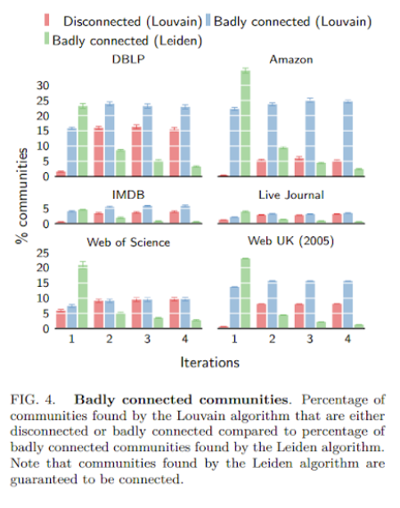

# Comparative Study of Louvain and Leiden Algorithms

### Abstract

Community detection is often used to understand the structure of large and complex networks. One of the most popular algorithms for uncovering community structure is the so-called Louvain algorithm. We show that this algorithm has a major defect that largely went unnoticed until now: the Louvain algorithm may yield arbitrarily badly connected communities. In the worst case, communities may even be disconnected, especially when running the algorithm iteratively. In our experimental analysis, we observe that up to 25% of the communities are badly connected and up to 16% are disconnected. To address this problem, we introduce the Leiden algorithm. We prove that the Leiden algorithm yields communities that are guaranteed to be connected. In addition, we prove that, when the Leiden algorithm is applied iteratively, it converges to a partition in which all subsets of all communities are locally optimally assigned. Furthermore, by relying on a fast local move approach, the Leiden algorithm runs faster than the Louvain algorithm. We demonstrate the performance of the Leiden algorithm for several benchmark and real-world networks. We find that the Leiden algorithm is faster than the Louvain algorithm and uncovers better partitions, in addition to providing explicit guarantees. 

### Annotated Bibliography
[From Louvain to Leiden: guaranteeing well-connected communities V.A. Traag, L. Waltman, and N.J. van Eck](https://arxiv.org/pdf/1810.08473.pdf)

This paper talks about the Leiden algorithm, a community detection network that was developed to address a critical flaw in the Louvain algorithm, another popular method for community detection in networks. The Louvain algorithm has been shown to produce poorly connected or even disconnected communities. To resolve this issue, the authors suggest that the proposed Leiden algorithm would not only guarantee the connectivity of communities but also ensure that it converges to a partition where all subsets of all communities are locally optimally assigned. The Leiden algorithm also entails the advantages of fast local move, and random neighbor move techniques, which outperforms the Louvain algorithm in terms of speed and the quality of the community partitions it finds.

### Experiments and Plan
The paper does a time analysis on Louvain and Leiden algorithms and concludes that Leiden is faster / more efficient. The paper also examines companies and characterizes communities within them. To modify this experiment for our purposes, we may instead look at Reddit user data if possible, so that we can access user community memberships.

Here is a snippet of what the results may look like:

We will be comparing the two models with different metrics to evaluate if Leiden performs better at Louvain in community partitioning and efficiency, while not losing the ability to connect. 

### Causes for Concern?

Our primary cause for concern is working with algorithms instead of full-blown models. To supplement this, we are using the Facebook data from prior notebooks. We may also try to pull data from Reddit since users are already part of communities.

### Next Steps

In the first week, we will collect any data needed (such as Reddit data or the Facebook data from prior notebooks) as a jump-off point for comparing the Louvain and Leiden algorithms, and find 1-2 more papers on the topic.  In following weeks, we will implement the Louvain algorithm, and later the Leiden algorithm. We will finally compare the two of them and analyze their strengths and weaknesses as algorithms for detecting communities. We’ll try to finish our project entirely by March 5.

